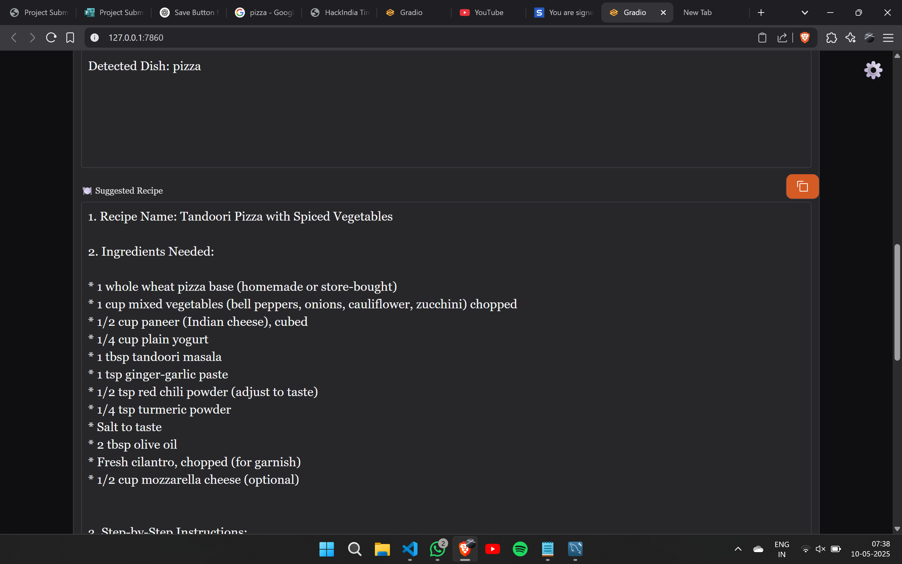

# TadkaGPT

A recipe generation AI model with a Desi twist!

TadkaGPT is an AI-powered recipe generation tool that takes in a list of ingredients and generates a recipe based on those ingredients. The model has been trained on a dataset of Indian recipes and can generate recipes in various regional styles of Indian cuisine.

## Features

* Generates recipes based on a list of ingredients
* Supports various regional styles of Indian cuisine
* Can generate recipes for different meal types (e.g. breakfast, lunch, dinner)
* Can generate recipes with different spice levels (e.g. mild, medium, spicy)

## How to use

1. Install the required packages using `pip install -r requirements.txt`
2. Run the application using `python main.py`
3. Open a web browser and navigate to `http://127.0.0.1:7860/`
4. Enter a list of ingredients in the input field and select the desired regional style, meal type, and spice level
5. Click the "Generate Recipe" button to generate a recipe based on the input ingredients

## Models used

The model used in this application is the Gemini model from the LangChain library. The Gemini model is a type of language model that is capable of generating text based on a given prompt. The model has been trained on a dataset of Indian recipes and can generate recipes in various regional styles of Indian cuisine.

## Acknowledgments

* The LangChain library for providing the Gemini model
* The Spoonacular API for providing nutrition data
* The Ultralytics library for providing the YOLO model used in image processing
* The Whisper library for providing the speech recognition model used in voice input
* The Hugging Face library for providing the Transformers library used in language processing
## Preview

for running the app use:
python main.py
